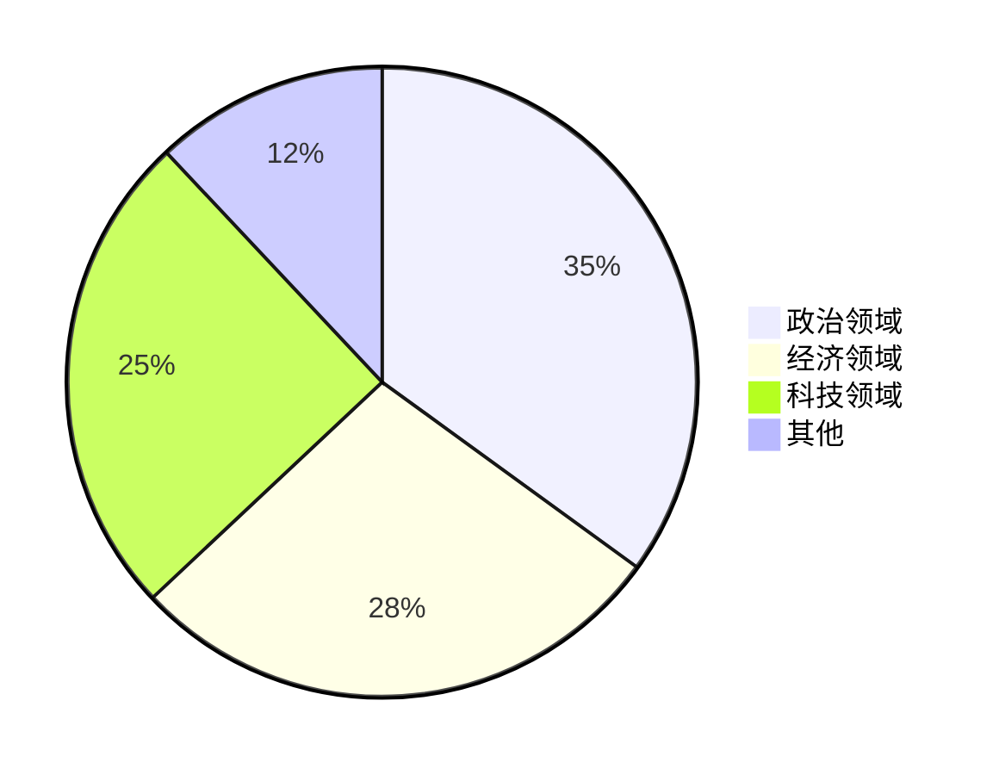
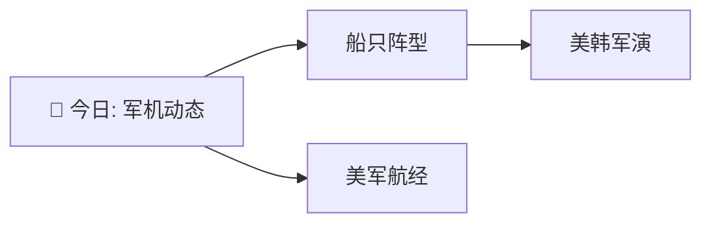

# 新闻分析系统 - 网页展示与反馈系统 技术方案

> **文档用途**：面向后续开发的指导性技术方案
> **文档版本**：V1.0（初稿，待讨论更新）
> **创建日期**：2026-03-20
> **状态**：待讨论

---

## 目录

1. [背景与目标](#1-背景与目标)
2. [报告形式优化](#2-报告形式优化)
3. [报告可视化方案](#3-报告可视化方案)
4. [系统架构概览](#4-系统架构概览)
5. [网页展示方案](#5-网页展示方案)
6. [反馈机制设计](#6-反馈机制设计)
7. [技术选型](#7-技术选型)
8. [数据模型](#8-数据模型)
9. [API设计](#9-api设计)
10. [实施计划](#10-实施计划)
11. [待讨论问题](#11-待讨论问题)

---

## 1. 背景与目标

### 1.1 当前状态

现有系统已实现：
- **Task1**：多信源RSS采集 → AI解析评分 → 存储SQLite
- **Task2**：从DB读取 → 简要报告 + 深度报告 → 邮件推送
- **新增（实施中）**：原文获取 → 全文向量关联 → 深度分析优化

### 1.2 新增目标

| 目标 | 说明 |
|------|------|
| **网页展示** | 通过Web界面展示每日摘要和深度分析 |
| **反馈机制** | 获取用户对报告质量的真实反馈 |
| **效果评估** | 基于反馈评估报告和分析的实际效果 |

### 1.4 项目定位

**核心定位**：在"手动阅读100篇新闻"和"订阅Bloomberg专业工具"之间，提供一个"每天10分钟，快速了解今天有什么重要新闻"的轻量选择。

**用户画像**：
| 用户类型 | 具体画像 | 需求 |
|----------|----------|------|
| 忙碌的决策者 | 企业高管、政府官员 | "今天有什么大事？我需要关注什么？" |
| 初创公司创始人 | 没有专职研究员 | "快速了解行业动态，不错过重要信息" |
| 个人投资者 | 非专业但有需求 | "每天10分钟了解市场，不用盯盘" |
| 知识工作者 | 记者、分析师助理 | "快速筛选新闻，聚焦重点" |

**设计原则**：
- 轻量化：比直接看新闻快，比专业工具成本低
- 快速筛选：帮用户决定"今天关注什么"
- 够用就好：不追求替代专业工具，追求"快速了解"

---

## 2. 报告形式优化

### 2.1 核心变化

| 变化项 | 原设计 | 新设计 |
|--------|--------|---------|
| 深度报告篇幅 | 1000-2000字/事件 | **300-500字/事件** |
| 历史关联 | 重点展示 | **折叠处理**，默认收起 |
| 标题风格 | 比喻式 | **描述性**，便于快速定位 |
| 5W1H | 为空则"无" | **标注"待获取"**，诚实展示 |

### 2.2 分层结构

```
报告层级：
┌─────────────────────────────────────────────┐
│ L1: 执行摘要（100字）                        │
│     - 一句话描述最重要的事                   │
│     - 对市场/业务的影响                     │
│     - 推荐行动                             │
└─────────────────────────────────────────────┘
┌─────────────────────────────────────────────┐
│ L2: 事件卡片（300字/事件）                  │
│     - 5W1H完整填充（不能为空）             │
│     - 关键事实（3条）                      │
│     - 直接影响                             │
└─────────────────────────────────────────────┘
┌─────────────────────────────────────────────┐
│ L3: 深度分析（可折叠，按需展开）            │
│     - 历史脉络                              │
│     - 趋势预判                            │
│     - 风险机遇                            │
└─────────────────────────────────────────────┘
```

---

## 3. 报告可视化方案

### 3.1 设计原则

| 原则 | 说明 |
|------|------|
| **辅助而非替代** | 图表是文字的补充，不能喧宾夺主 |
| **适度使用** | 每个报告最多2-3个图表，避免视觉疲劳 |
| **技术可行** | 基于Mermaid（Markdown兼容），成本为零 |

### 3.2 可视化类型

| 图表类型 | 适用场景 | 位置 | 优先级 |
|----------|----------|------|--------|
| 饼图 | 领域分布占比 | 报告开头 | P0 |
| 折线图 | 7天趋势 | 报告开头 | P0 |
| 关系图 | 事件关联拓扑 | 历史关联章节 | P1 |
| 甘特图 | 事件时间线 | 历史关联章节 | P2 |

### 3.3 图表示例

#### 领域分布饼图
```markdown
### 新闻分布

```

#### 7天趋势折线图
```markdown
### 近7天趋势
```mermaid
linechart
    title 新闻数量趋势
    03-10: 4
    03-11: 35
    03-12: 134
    03-13: 212
    03-14: 75
    03-15: 81
    03-16: 16
```
```

#### 事件关系拓扑图
```markdown
### 事件关联

```

### 3.4 实施约束

| 约束 | 说明 |
|------|------|
| 图表数量 | 每个报告最多3个，避免视觉干扰 |
| 位置 | 图表放在报告开头或章节开头，作为概览 |
| PDF兼容 | 需测试Mermaid在PDF转换时的渲染效果 |

---

## 4. 系统架构概览

### 4.1 反馈机制的价值

| 评估方式 | 问题 |
|----------|------|
| AI自评 | 自我参照，无法发现盲点 |
| 对比人工报告 | 需要大量人工成本 |
| **用户反馈** | 直接来源于使用者，但如何结构化？ |

**结论**：用户反馈是评估报告质量的必要补充，但需要设计合理的反馈机制避免偏见和噪声。

---

## 5. 网页展示方案

### 5.1 页面结构

```
┌─────────────────────────────────────────────────────────────┐
│                        用户端                                 │
│  ┌─────────────┐  ┌─────────────┐  ┌─────────────┐         │
│  │  今日摘要    │  │  深度报告    │  │  历史报告    │         │
│  │  (Brief)   │  │  (Depth)   │  │  (Archive)  │         │
│  └──────┬──────┘  └──────┬──────┘  └──────┬──────┘         │
│         │                 │                 │                │
│         └─────────────────┼─────────────────┘                │
│                           │                                  │
│                    ┌──────▼──────┐                           │
│                    │   反馈组件   │                           │
│                    │  (Feedback) │                           │
│                    └──────┬──────┘                           │
└───────────────────────────┼───────────────────────────────────┘
                            │
                    ┌───────▼───────┐
                    │   Web 前端    │
                    │   (React)    │
                    └───────┬───────┘
                            │ HTTP/REST
                    ┌───────▼───────┐
                    │   API 后端    │
                    │   (FastAPI)  │
                    └───────┬───────┘
                            │
              ┌─────────────┼─────────────┐
              │             │             │
        ┌─────▼─────┐ ┌─────▼─────┐ ┌─────▼─────┐
        │  报告存储   │ │  反馈存储   │ │  用户管理   │
        │ (FileSystem│ │ (SQLite)  │ │ (可选)    │
        └───────────┘ └───────────┘ └───────────┘
```

### 4.2 与现有系统关系

```
现有系统（每日定时运行）
    │
    ├── Task1: 采集 → news.db
    ├── Task2: 生成报告 → reports/{date}/*.md
    │
    ▼
新增：Web服务（常驻进程）
    │
    ├── 读取 reports/ 目录展示报告
    ├── 读取 news.db 获取数据
    └── 存储反馈到 feedback.db
```

---

## 3. 网页展示方案

### 3.1 页面结构

| 页面 | 内容 | 路径 |
|------|------|------|
| **首页/今日** | 当日摘要报告列表 + 市场数据仪表盘 | `/` |
| **深度报告** | 当日深度分析报告（按领域） | `/depth` |
| **事件详情** | 单个事件的深度分析内容 | `/event/{id}` |
| **历史报告** | 历史报告存档（按日期/领域） | `/archive` |
| **关于** | 系统说明和使用指南 | `/about` |

### 5.2 页面设计原则

**优先级**：
1. **可读性第一**：清晰的信息层次，适合快速浏览
2. **移动端优先**：支持手机查看
3. **性能优先**：首屏加载 < 2秒

**导航设计**：
```
┌─────────────────────────────────────────────────────┐
│ Logo  今日  深度报告  历史  关于        [反馈入口]  │
└─────────────────────────────────────────────────────┘
```

### 5.3 今日摘要页面

```markdown
## 今日概览
[日期] [星期几]

### 市场数据（可选折叠）
- 汇率
- 主要指数
- 大宗商品

### TOP 10 新闻
┌─────────────────────────────────────────────────────┐
│ [领域标签]  新闻标题                                │
│ 来源 | 时间 | AI评分                               │
│ 5W1H摘要...                                        │
│ [查看详情] [查看原文]                              │
└─────────────────────────────────────────────────────┘
```

### 3.4 深度报告页面

```markdown
## 深度分析报告

### 领域选择
[政治] [经济] [科技] [全部]

### TOP5 事件（可折叠）
┌─────────────────────────────────────────────────────┐
│ 事件1：事件标题                                    │
│ 5W1H | 高质量摘要 | 关键事实 | 合理推演           │
│ [展开] [查看原文链接] [反馈]                        │
└─────────────────────────────────────────────────────┘
```

---

## 4. 反馈机制设计

### 4.1 反馈类型

| 类型 | 说明 | 优先级 |
|------|------|--------|
| **显式反馈** | 用户主动评分 | P0 |
| **隐式反馈** | 行为追踪 | P1 |

### 4.2 显式反馈设计

**设计原则**：
- **简单优先**：用户愿意反馈是关键
- **结构化**：便于统计和分析
- **可解释**：用户知道反馈的用途

**反馈选项**：

```markdown
## 这篇分析对你有帮助吗？

[👍 有帮助]  [👎 没帮助]

可选原因（帮助了哪里？多选）：
- [ ] 信息准确
- [ ] 分析逻辑清晰
- [ ] 帮我了解了事件背景
- [ ] 预测/建议有参考价值
- [ ] 内容详实

可选原因（哪里可以改进？多选）：
- [ ] 内容过于简略
- [ ] 分析深度不足
- [ ] 预测不够准确
- [ ] 逻辑不够清晰
- [ ] 其他：________
```

**事件级反馈**：
- 用户阅读完每个事件的深度分析后，可以给出反馈
- 反馈按钮在事件详情页和深度报告页都可访问

### 4.3 隐式反馈设计

追踪用户行为（无感收集）：

| 行为 | 指标 | 用途 |
|------|------|------|
| 阅读时长 | 停留时间 | 判断内容吸引力 |
| 滚动深度 | 阅读完成度 | 判断内容长度是否合适 |
| 点击"查看原文" | 外部链接点击率 | 判断原文需求 |
| 收藏/分享 | 互动行为 | 判断内容价值 |
| 返回重读 | 重复访问 | 判断历史价值 |

### 4.4 反馈数据用途

**不是用来自动改进系统**，而是用于**人工复盘**：

| 用途 | 说明 |
|------|------|
| **周期性复盘** | 每周/每月Review反馈数据 |
| **问题发现** | 发现系统性问题（如某领域评价持续偏低） |
| **迭代参考** | 作为下个Sprint的输入 |
| **效果评估** | 评估新增功能（如原文获取）的实际效果 |

---

## 5. 技术选型

### 5.1 前端

| 选择 | 技术 | 理由 |
|------|------|------|
| 框架 | **React** 或 **Vue** | 生态成熟，开发效率高 |
| UI库 | **Tailwind CSS** + **Headless UI** | 快速构建，定制灵活 |
| 状态管理 | React Context / Pinia | 轻量级足够 |
| 部署 | 静态托管（Vercel/Netlify） | 成本低，CDN加速 |

### 5.2 后端

| 选择 | 技术 | 理由 |
|------|------|------|
| 框架 | **FastAPI** | Python技术栈一致，高性能 |
| 数据库 | **SQLite**（新增feedback.db） | 与现有系统一致 |
| 认证 | 可选（JWT） | 初期可匿名，后续按需添加 |

### 5.3 部署架构

**选项A：独立部署**（推荐用于初期）
```
Web服务进程（独立于Task1/Task2）
    ├── FastAPI后端（8000端口）
    └── Nginx反向代理
```

**选项B：集成到现有系统**
- 在Task2完成后，Web服务启动
- 使用Systemd管理进程

---

## 6. 数据模型

### 6.1 反馈表（feedback.db）

```sql
-- 用户反馈记录
CREATE TABLE feedback (
    id INTEGER PRIMARY KEY AUTOINCREMENT,
    report_date TEXT NOT NULL,           -- 报告日期 2026-03-20
    event_id TEXT,                       -- 事件ID（可为NULL表示整体反馈）
    domain TEXT,                          -- 领域（政治/经济/科技）

    -- 反馈内容
    is_helpful BOOLEAN,                  -- 是否有帮助
    help_reasons TEXT,                    -- 帮助原因（JSON数组）
    improve_reasons TEXT,                  -- 改进原因（JSON数组）
    user_comment TEXT,                    -- 用户留言

    -- 隐式反馈
    read_duration INTEGER DEFAULT 0,      -- 阅读时长（秒）
    scroll_depth REAL DEFAULT 0,          -- 滚动深度（0-1）
    clicked_original_link BOOLEAN,         -- 是否点击原文

    -- 元数据
    created_at TEXT DEFAULT CURRENT_TIMESTAMP,
    session_id TEXT,                      -- 会话ID（匿名用户标识）
    user_agent TEXT
);

-- 索引
CREATE INDEX idx_feedback_date ON feedback(report_date);
CREATE INDEX idx_feedback_event ON feedback(event_id);
```

### 6.2 报告文件结构

```
reports/
└── {YYYY-MM-DD}/
    ├── brief/
    │   └── daily_brief_{date}.md
    ├── depth/
    │   ├── daily_report_depth_政治_{date}.md
    │   ├── daily_report_depth_经济_{date}.md
    │   └── daily_report_depth_科技_{date}.md
    └── metadata.json              -- 新增：报告元数据
```

### 6.3 metadata.json 示例

```json
{
  "date": "2026-03-20",
  "brief": {
    "news_count": 45,
    "top_domains": ["政治", "科技", "经济"]
  },
  "depth": {
    "政治": {"event_count": 5, "file": "daily_report_depth_政治_2026-03-20.md"},
    "经济": {"event_count": 4, "file": "daily_report_depth_经济_2026-03-20.md"},
    "科技": {"event_count": 6, "file": "daily_report_depth_科技_2026-03-20.md"}
  }
}
```

---

## 7. API设计

### 7.1 报告相关

| 方法 | 路径 | 说明 |
|------|------|------|
| GET | `/api/reports/today` | 获取今日报告列表 |
| GET | `/api/reports/{date}` | 获取指定日期报告列表 |
| GET | `/api/reports/brief/{date}` | 获取简要报告内容 |
| GET | `/api/reports/depth/{date}/{domain}` | 获取深度报告内容 |
| GET | `/api/reports/events/{event_id}` | 获取事件详情 |

### 7.2 反馈相关

| 方法 | 路径 | 说明 |
|------|------|------|
| POST | `/api/feedback` | 提交反馈 |
| GET | `/api/feedback/stats` | 获取反馈统计（管理端） |

### 7.3 响应格式

```json
// GET /api/reports/today
{
  "date": "2026-03-20",
  "brief": {
    "exists": true,
    "path": "/api/reports/brief/2026-03-20"
  },
  "depth": [
    {"domain": "政治", "exists": true, "path": "/api/reports/depth/2026-03-20/政治"},
    {"domain": "经济", "exists": true, "path": "/api/reports/depth/2026-03-20/经济"},
    {"domain": "科技", "exists": false}
  ]
}
```

---

## 8. 实施计划

### Phase 1：基础展示（MVP）

**目标**：最小可用品，只展示报告

| 任务 | 优先级 | 工作量 |
|------|--------|--------|
| 项目初始化（React + FastAPI） | P0 | 1天 |
| 报告文件读取API | P0 | 0.5天 |
| 今日报告页面 | P0 | 1天 |
| 深度报告页面 | P0 | 1天 |
| 历史报告页面 | P1 | 0.5天 |

**交付物**：用户可通过网页查看每日报告

### Phase 2：反馈机制

**目标**：收集用户反馈

| 任务 | 优先级 | 工作量 |
|------|--------|--------|
| 反馈数据模型 | P0 | 0.5天 |
| 反馈提交API | P0 | 0.5天 |
| 前端反馈组件 | P0 | 1天 |
| 反馈统计页面（管理端） | P1 | 1天 |

**交付物**：用户可提交反馈，后台可查看统计

### Phase 3：优化增强

**目标**：基于反馈优化体验

| 任务 | 优先级 |
|------|--------|
| 隐式反馈追踪 |
| 用户行为分析 |
| 报告内容优化（根据反馈） |
| 移动端适配 |

---

## 9. 待讨论问题

### 9.1 技术选型

| 问题 | 选项 |
|------|------|
| 前端框架 | React vs Vue vs Next.js |
| 后端框架 | FastAPI vs Flask vs Django |
| 部署方式 | 独立服务器 vs 云函数 |

### 9.2 功能范围

| 问题 | 说明 |
|------|------|
| 是否需要用户认证？ | 初期可匿名，后续按需 |
| 是否需要实时更新？ | 当前是每日生成，可考虑定时刷新 |
| 是否支持邮件登录查看？ | 与现有邮件推送的关系 |

### 9.3 反馈机制

| 问题 | 说明 |
|------|------|
| 反馈数据保留多久？ | 建议6个月 |
| 是否需要用户画像？ | 按需 |
| 如何避免垃圾反馈？ | 简单验证码或登录限制 |

### 9.4 与现有系统集成

| 问题 | 说明 |
|------|------|
| Web服务如何访问报告？ | 共享文件系统或复制到Web目录 |
| 是否需要修改Task2？ | 建议只读，不修改 |
| 反馈数据如何影响报告生成？ | 初期不联动，后续按需 |

---

## 附录：参考案例

1. **Notion Daily Notes**：类似的信息聚合展示
2. **Google News**：新闻类应用参考
3. **Pocket/Capsule**：阅读反馈机制参考

---

**文档状态**：待讨论更新
**下次Review**：待定
